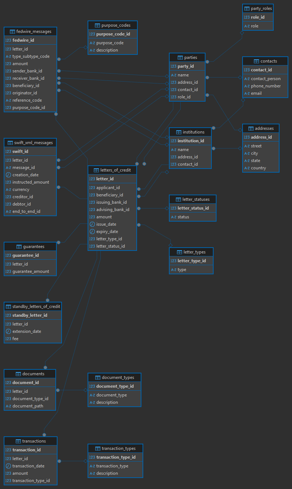

# GlobalTrade

## Overview

GlobalTrade is a comprehensive database designed to manage and track various aspects of global trade transactions. The database includes detailed information about addresses, contacts, institutions, parties, letters of credit, transactions, and related documents.

## Database Structure

The database consists of the following tables:

- **addresses**: Stores address information.
- **contacts**: Stores contact details.
- **institutions**: Stores information about financial institutions.
- **party_roles**: Defines roles for parties (e.g., Buyer, Seller).
- **parties**: Stores information about parties involved in transactions.
- **letter_types**: Defines types of letters of credit.
- **letter_statuses**: Defines statuses for letters of credit.
- **letters_of_credit**: Stores information about letters of credit.
- **standby_letters_of_credit**: Stores information about standby letters of credit.
- **guarantees**: Stores information about guarantees.
- **document_types**: Defines types of documents.
- **documents**: Stores information about documents related to letters of credit.
- **transaction_types**: Defines types of transactions.
- **transactions**: Stores information about transactions.
- **purpose_codes**: Defines purpose codes for transactions.
- **fedwire_messages**: Stores information about Fedwire messages.
- **swift_xml_messages**: Stores information about SWIFT XML messages.

## Sample Data

The database is populated with sample data to demonstrate its functionality. Here are some highlights:

- **Addresses**: Includes addresses from various cities around the world.
- **Contacts**: Includes contact details for individuals associated with different institutions.
- **Institutions**: Includes major financial institutions like Bank of America, Wells Fargo, Chase Bank, etc.
- **Parties**: Includes companies like ABC Corp, XYZ Ltd, Global Traders, etc.
- **Letters of Credit**: Includes various letters of credit with different types and statuses.
- **Transactions**: Includes payment, fee, and extension transactions.

## How to Use

1. **Create the Database**: Run the SQL script in [db/tables.sql](db/tables.sql) to create the database and tables.
2. **Insert Sample Data**: Run the SQL script in [db/inserts.sql](db/inserts.sql) to insert sample data into the tables.

## Docker Setup

The project includes a `Dockerfile` to set up a Microsoft SQL Server 2019 instance:

```dockerfile
# Use the official Microsoft SQL Server 2019 image from the Docker Hub
FROM mcr.microsoft.com/mssql/server:2019-latest

# Set environment variables from the .env file
ENV ACCEPT_EULA=${ACCEPT_EULA}
ENV SA_PASSWORD=${SA_PASSWORD}
ENV MSSQL_PID=${MSSQL_PID}

# Expose the SQL Server port
EXPOSE 1433

# Run SQL Server process
CMD ["/opt/mssql/bin/sqlservr"]
```

### To build and run the Docker container, use the following commands:

```sh
docker build -t globaltrade-db .
docker run --env-file .env -p 1433:1433 --name globaltrade-db -d globaltrade-db
```

### Environment Variables

The `.env` file should contain the following environment variables:

```
ACCEPT_EULA=Y
SA_PASSWORD=YourStrong!Passw0rd
MSSQL_PID=Express
```

## Entity Relationship Diagram

